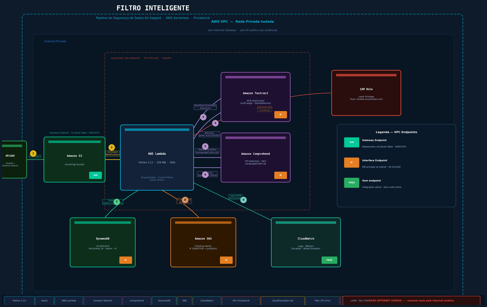

# filtro-inteligente


-red)


## O que é isso

Pipeline serverless que processa documentos e detecta dados sensíveis (PII)
via OCR + NLP, garantindo que nenhum byte trafegue pela internet pública.
Usa VPC Interface Endpoints (AWS PrivateLink) em vez de NAT Gateway —
isolamento de rede por design arquitetural, não por regra de firewall.

## Arquitetura



## Tech Stack

| Serviço          | Propósito                              |
|------------------|----------------------------------------|
| Lambda (Python)  | Orquestrador event-driven              |
| Textract         | OCR assíncrono de documentos           |
| Comprehend       | Detecção de PII (NLP, pt-BR)           |
| DynamoDB         | Metadados de análise (on-demand)       |
| SNS              | Alertas de risco em tempo real         |
| VPC Endpoints    | Air-gap de rede (PrivateLink)          |
| CloudFormation   | Infraestrutura como Código             |

## Como rodar

### Pré-requisitos
- AWS CLI configurada com credenciais válidas
- Python 3.13

### Deploy completo

```bash
# Deploy da VPC e endpoints
aws cloudformation deploy \
  --template-file infra/vpc.yaml \
  --stack-name filtro-inteligente-vpc \
  --capabilities CAPABILITY_IAM

# Deploy da aplicação
aws cloudformation deploy \
  --template-file infra/template.yaml \
  --stack-name filtro-inteligente \
  --capabilities CAPABILITY_IAM
```

### Teardown (para economizar custo dos Interface Endpoints)

```bash
aws cloudformation delete-stack --stack-name filtro-inteligente-vpc
```

## Decisões-chave & tradeoffs

**PrivateLink > NAT Gateway**: NAT Gateway roteia para IPs públicos da AWS.
Interface Endpoints criam ENIs privadas — tráfego nunca deixa o backbone AS16509.
Tradeoff: +$0.01/hora/AZ por endpoint. Mitigado com IaC (destruir após testes).

**Gateway Endpoint para S3**: Gratuito vs Interface Endpoint pago sem ganho funcional.
Escolha correta para S3 e DynamoDB — Gateway Endpoint é a recomendação da AWS.

## Troubleshooting documentado

Ver [docs/troubleshooting.md](docs/troubleshooting.md) para bugs encontrados
durante o desenvolvimento e suas soluções.

## Autor

Lazim Francisco de Oliveira Junior  
[linkedin.com/in/seu-perfil](https://linkedin.com/in/seu-perfil) · [github.com/lazim-Junior](https://github.com/lazim-Junior)
